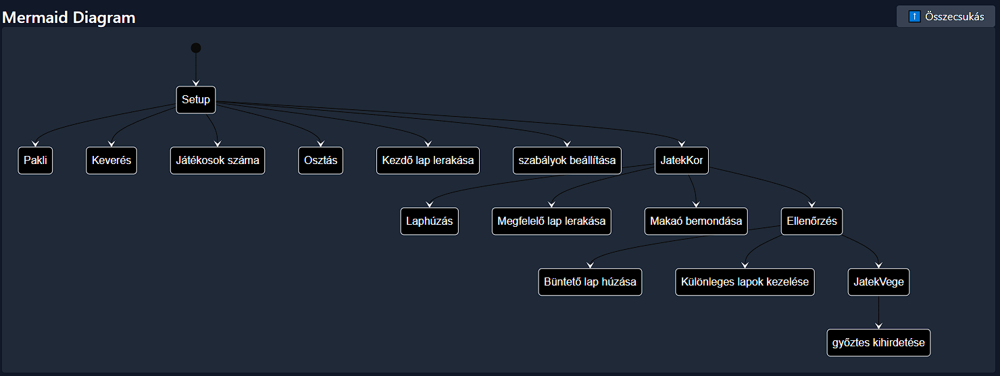
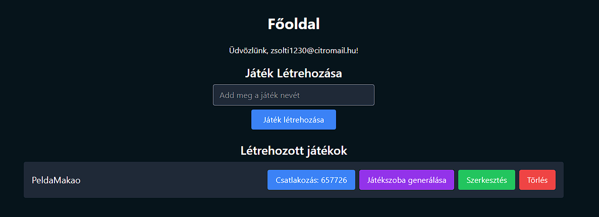

> **Szegedi Tudományegyetem Informatikai Intézet**

**SZAKDOLGOZAT**

**Kaszás Zsolt József**

> **2025**
>
> **Szegedi Tudományegyetem Informatikai Intézet**
>
> **Kártyajáték Készítő weboldal**
>
> Szakdolgozat

Készítette: Témavezető:

**Kaszás Zsolt József** **Dr. Nagy Antal Sándor**

programtervező informatika szakos

> egyetemi docens
>
> hallgató
>
> Szeged
>
> 2025

# Feladatkiírás

Napjainkban az online kártyajátékok tervezése és futtatása egyre nagyobb
teret nyer mind a fejlesztők, mind a játékosok körében. A különféle
játékszabályok gyors kipróbálásához és teszteléséhez rugalmas, könnyen
használható eszközökre van szükség.

A hallgató feladata egy webalapú kártyajáték-készítő rendszer
megvalósítása React és Node.js technológiákkal.

Megvalósítandó főbb követelmények:

- Szerkeszthet saját játékszabályokat (állapotok, akciók) könnyen
  áttekinthető felületen

- Generálhat belőle futtatható kódot

- Tesztelheti az elkészült játékot egy beépített játékmotorral

- Létrehozhat és csatlakozhat valós idejű, játékszobákhoz, ahol többen
  is játszhatják ugyanazt a konfigurációt

Az alkalmazást felhasználóbarát felülettel kell ellátni, amely intuitív
módon teszi elérhetővé a funkciókat. A program dokumentációjának
tartalmaznia kell a megvalósított weboldal ismertetését és a felhasznált
technológiák bemutatását.

# Tartalmi összefoglaló

**A téma megnevezése**

> Kártyajáték-készítő weboldal

**A megadott feladat megfogalmazása**

> Olyan webes platform fejlesztése, ahol a felhasználók létrehozhatják
> saját kártyajátékaikat, játékszobákba csatlakozhatnak és akár együtt
> játszhatnak.

**Alkalmazott eszközök, módszerek**

> A frontend React + TypeScript környezetben készült, Tailwind CSS-sel a
> stílusokért, DnD-Kit-tel a drag-&-drop funkciókért és a Monaco
> Editorral a JSON- és kódszerkesztésért. A backend Node.js + Express
> szolgál API-ként, JWT és bcrypt gondoskodik a hitelesítésről, MySQL
> (mysql2/promise) tárolja a felhasználói és játékkonfigurációkat,
> Socket.IO pedig kezelni a valós idejű eseményeket (csatlakozás,
> állapotváltozás, akciók).

**Elért eredmények**

> A felhasználók szerkeszthetnek állapotgépeket, egy gombnyomással
> generálva hozzá tartozó TypeScript-osztályt amit lehetőség van
> szerkeszteni. A beépített GameEngine lépésenkénti tesztelést,
> visszalépést és választási időkorlátok kezelését teszi lehetővé. A
> teljeskörű CRUD támogatással regisztráció és játékkonfiguráció-kezelés
> is működik, miközben valós idejű játékszobákba több játékos
> csatlakozhat és játszhat az elkészült játékkal.

# Tartalom

[Feladatkiírás [2](#feladatkiírás)](#feladatkiírás)

[Tartalmi összefoglaló
[3](#tartalmi-összefoglaló)](#tartalmi-összefoglaló)

[Tartalom [4](#tartalom)](#tartalom)

[Bevezetés [8](#bevezetés)](#bevezetés)

[1 Szakirodalmi áttekintés
[8](#szakirodalmi-áttekintés)](#szakirodalmi-áttekintés)

[1.1 Kártyajáték‑készítés és állapotgépek
[8](#kártyajátékkészítés-és-állapotgépek)](#kártyajátékkészítés-és-állapotgépek)

[1.2 Webes többjátékos rendszerek – rövid áttekintés
[9](#webes-többjátékos-rendszerek-rövid-áttekintés)](#webes-többjátékos-rendszerek-rövid-áttekintés)

[2 Megvalósítás [9](#megvalósítás)](#megvalósítás)

[2.1 Rendszerterv [9](#rendszerterv)](#rendszerterv)

[2.1.1 Architektúra áttekintése (frontend – backend – adatbázis)
[10](#architektúra-áttekintése-frontend-backend-adatbázis)](#architektúra-áttekintése-frontend-backend-adatbázis)

[2.1.2 API‑ és adatmodell [11](#api-és-adatmodell)](#api-és-adatmodell)

[2.1.3 Játékszobák és valós idejű kommunikáció
[12](#játékszobák-és-valós-idejű-kommunikáció)](#játékszobák-és-valós-idejű-kommunikáció)

[2.2 Frontend (React + TypeScript) – főbb komponensek
[14](#frontend-react-typescript-főbb-komponensek)](#frontend-react-typescript-főbb-komponensek)

[2.2.1 Alapszerkezet és útválasztás
[14](#alapszerkezet-és-útválasztás)](#alapszerkezet-és-útválasztás)

[2.2.2 Oldalak (Pages) [14](#oldalak-pages)](#oldalak-pages)

[2.2.3 Global UI-komponensek
[14](#global-ui-komponensek)](#global-ui-komponensek)

[2.2.4 Játékkonfiguráció-szerkesztő komponensek
[14](#játékkonfiguráció-szerkesztő-komponensek)](#játékkonfiguráció-szerkesztő-komponensek)

[2.2.5 Kódgenerálás és tesztelés
[15](#kódgenerálás-és-tesztelés)](#kódgenerálás-és-tesztelés)

[2.2.6 Mentés és szolgáltatások
[15](#mentés-és-szolgáltatások)](#mentés-és-szolgáltatások)

[2.2.7 Játék-UI komponensek
[15](#játék-ui-komponensek)](#játék-ui-komponensek)

[2.2.8 Állapotkezelés, kontextus, hook-ok
[15](#állapotkezelés-kontextus-hook-ok)](#állapotkezelés-kontextus-hook-ok)

[2.2.9 Játékmotor és kliens
[16](#játékmotor-és-kliens)](#játékmotor-és-kliens)

[2.2.10 Segédfüggvények [16](#segédfüggvények)](#segédfüggvények)

[2.3 Backend (Node.js + Express) szolgáltatások, hitelesítés
[16](#backend-node.js-express-szolgáltatások-hitelesítés)](#backend-node.js-express-szolgáltatások-hitelesítés)

[2.3.1 Környezet és modulok
[16](#környezet-és-modulok)](#környezet-és-modulok)

[2.3.2 Adatbázis és modell réteg
[17](#adatbázis-és-modell-réteg)](#adatbázis-és-modell-réteg)

[2.3.3 Hitelesítés (Authentication)
[17](#hitelesítés-authentication)](#hitelesítés-authentication)

[2.4 Játékmotor és szobamenedzsment
[18](#játékmotor-és-szobamenedzsment)](#játékmotor-és-szobamenedzsment)

[2.4.1 Állapotgép-alapú játékmotor
[18](#állapotgép-alapú-játékmotor)](#állapotgép-alapú-játékmotor)

[2.4.2 Kliensoldali motor‐csomag
[19](#kliensoldali-motorcsomag)](#kliensoldali-motorcsomag)

[2.4.3 Szobamenedzsment [19](#szobamenedzsment)](#szobamenedzsment)

[3 Felhasználói útmutató
[21](#felhasználói-útmutató)](#felhasználói-útmutató)

[3.1 Regisztráció [21](#regisztráció)](#regisztráció)

[3.2 Bejelentkezés [22](#bejelentkezés)](#bejelentkezés)

[3.3 Játék létrehozása [22](#játék-létrehozása)](#játék-létrehozása)

[3.3.1 Játék létrehozása gombbal (sablon nélkül)
[23](#játék-létrehozása-gombbal-sablon-nélkül)](#játék-létrehozása-gombbal-sablon-nélkül)

[3.3.2 Játék készítése gombbal (sablon alap játékkal)
[23](#játék-készítése-gombbal-sablon-alap-játékkal)](#játék-készítése-gombbal-sablon-alap-játékkal)

[3.4 Játék törlése [24](#játék-törlése)](#játék-törlése)

[3.5 Játék szerkesztés elkezdése
[25](#játék-szerkesztés-elkezdése)](#játék-szerkesztés-elkezdése)

[3.6 A Játék­szerkesztő használata
[25](#a-játékszerkesztő-használata)](#a-játékszerkesztő-használata)

[3.6.1 Szerkesztő [26](#szerkesztő)](#szerkesztő)

[3.6.2 JSON szerkesztő [28](#json-szerkesztő)](#json-szerkesztő)

[3.6.3 Mermaid Diagram [28](#mermaid-diagram)](#mermaid-diagram)

[3.6.4 Generált Játék Class
[29](#generált-játék-class)](#generált-játék-class)

[3.6.5 Alap Kód generálása különbség nézet
[30](#alap-kód-generálása-különbség-nézet)](#alap-kód-generálása-különbség-nézet)

[3.6.6 Játék tesztelése [31](#játék-tesztelése)](#játék-tesztelése)

[3.7 A kártyajátékban előre definiált funkciók ismertetése
[32](#a-kártyajátékban-előre-definiált-funkciók-ismertetése)](#a-kártyajátékban-előre-definiált-funkciók-ismertetése)

[3.7.1 Kártyapakli beállítás
[32](#kártyapakli-beállítás)](#kártyapakli-beállítás)

[3.7.2 Kártyák osztása, húzás
[32](#kártyák-osztása-húzás)](#kártyák-osztása-húzás)

[3.7.3 Kártyák kezelése a kézben
[34](#kártyák-kezelése-a-kézben)](#kártyák-kezelése-a-kézben)

[3.7.4 Húzópakli (draw pile) kezelése
[35](#húzópakli-draw-pile-kezelése)](#húzópakli-draw-pile-kezelése)

[3.7.5 Asztalkezelés [35](#asztalkezelés)](#asztalkezelés)

[3.7.6 Eseménykezelés [36](#eseménykezelés)](#eseménykezelés)

[3.7.7 Játékosok és kézek lekérdezése
[36](#játékosok-és-kézek-lekérdezése)](#játékosok-és-kézek-lekérdezése)

[3.7.8 Egyéb segédfunkciók
[37](#egyéb-segédfunkciók)](#egyéb-segédfunkciók)

[3.8 Példa játék bővítés
[37](#példa-játék-bővítés)](#példa-játék-bővítés)

[3.9 Játék frissítése, mentése
[42](#játék-frissítése-mentése)](#játék-frissítése-mentése)

[3.10 Játékszoba létrehozása
[43](#játékszoba-létrehozása)](#játékszoba-létrehozása)

[3.11 Felső menüsor [43](#felső-menüsor)](#felső-menüsor)

[3.11.1 Főoldal [43](#főoldal)](#főoldal)

[3.11.2 Játékszobába csatlakozás
[43](#játékszobába-csatlakozás)](#játékszobába-csatlakozás)

[3.11.3 Játék készítés [44](#játék-készítés)](#játék-készítés)

[3.11.4 Kijelentkezés [44](#kijelentkezés)](#kijelentkezés)

[3.12 Játékszobába csatlakozás
[44](#játékszobába-csatlakozás-1)](#játékszobába-csatlakozás-1)

[3.13 Játék szoba ismertetése.
[45](#játék-szoba-ismertetése.)](#játék-szoba-ismertetése.)

[3.13.1 Ha a felhasználó hozta létre a szobát.
[45](#ha-a-felhasználó-hozta-létre-a-szobát.)](#ha-a-felhasználó-hozta-létre-a-szobát.)

[3.13.2 Ha a felhasználó egy játékos
[45](#ha-a-felhasználó-egy-játékos)](#ha-a-felhasználó-egy-játékos)

[3.14 Választó menü [46](#választó-menü)](#választó-menü)

[4 Összefoglalás [46](#összefoglalás)](#összefoglalás)

[5 Irodalomjegyzék [47](#irodalomjegyzék)](#irodalomjegyzék)

[6 Ábrajegyzék [49](#ábrajegyzék)](#ábrajegyzék)

[7 Elektronikus melléklet tartalma
[49](#elektronikus-melléklet-tartalma)](#elektronikus-melléklet-tartalma)

[Nyilatkozat [50](#nyilatkozat)](#nyilatkozat)

# Bevezetés

Az emberi természet egyik alapvető vonása a játék iránti vágy: már
gyermekként is örömünket leljük az időtöltésben, a kreatív
gondolkodásban és a közösségi élményben, amit a játékok nyújtanak.
Különösen a kártyajátékok rendelkeznek azzal a varázzsal, hogy egyszerre
kínálnak stratégiai kihívást és szórakozást, ráadásul baráti társaságban
még élvezetesebbek. Napjaink digitális világában viszont gyakran
hiányzik az a könnyen elérhető, rugalmas eszköz, amely lehetővé tenné
saját szabályok, kártyatípusok és játékmenetek megalkotását, valamint a
többjátékos tesztelést online környezetben.

Egy olyan webes platform létrehozása volt a célom, amely hidat képez a
játéktervezés és a megvalósítás között: a felhasználók vizuális
felületen, drag-and-drop módon építhetik fel saját kártyajátékaik
állapotgépeit, majd egy kattintással generálhatnak hozzá előre
konfigurált TypeScript osztályvázat, amelybe az egyéni logikájukat
illeszthetik. Emellett a rendszer biztosítja a játék azonnali, beépített
játékmotorral történő kipróbálását, valamint valós idejű, többjátékos
szobákban történő együttjátszást, így a tervezéstől a közös élményig
minden egy helyen elérhető.

A platform megalkotásával szeretném ösztönözni a kreatív játéktervezést,
megkönnyíteni az új szabályok gyors tesztelését, és lehetőséget adni
arra, hogy akár baráti társaságban, akár fejlesztői közösségben együtt
fedezzük fel a kártyajátékok végtelenül változatos világát.

# Szakirodalmi áttekintés

A kártyajáték-készítés és a webes többjátékos rendszerek elméleti
háttere elengedhetetlen egy dinamikus, felhasználó által definiálható
szabályrendszerre épülő platform kialakításához, hiszen ezek az
ismeretek teszik lehetővé az állapotgépekkel történő
játékmenet-modellezést és a valós idejű, többfelhasználós interakció
megbízható megvalósítását.

## Kártyajáték‑készítés és állapotgépek

A kártyajátékok felépítésekor a játékmenet logikáját gyakran véges
állapotgépekkel (finite-state machines, FSM) modellezik. Egy állapotgép
világosan elkülöníti a játék különböző fázisait (például osztás, húzás,
lejátszás, pontszámítás), és az ezek közötti átmeneteket a játékosok
által végrehajtott események (akciók) indítják el. Ez a megközelítés
elősegíti a szabályrendszer átláthatóságát, egyszerűsíti a hibakeresést,
és könnyen bővíthető felületet kínál új játékelemek beépítéséhez.

A játéklogika JSON-szerű leírása révén az állapotgépek deklaratív módon
tárolhatók, s így egy általános célú futtatókörnyezet – egy generikus
játékmotor – használatával dinamikusan tölthetők be és futtathatók. A
vizuális szerkesztőeszközök (drag-and-drop diagramok, kódszerkesztők)
lehetővé teszik, hogy a tervezők kódolás nélkül, grafikus felületen
építsék fel az állapotgépet, míg a háttérben a motor az átmeneteket és
akciókat automatikusan kezeli.

Így az állapotgépek alkalmazása garantálja a kártyajátékok szabályainak
következetességét, skálázhatóságát és tesztelhetőségét, függetlenül
attól, hogy egyszerűbb hagyományos kártyajátékokról vagy komplex,
többfázisú stratégiai játékokról van-e szó.

## Webes többjátékos rendszerek – rövid áttekintés

A többjátékos webalkalmazások alapját a valós idejű kommunikációs
csatornák képezik, amelyek lehetővé teszik, hogy a kliensoldali
események (például kártyahúzás, lépésvégrehajtás) azonnal megjelenjenek
a többi résztvevőnél. Ezt a funkcionalitást leggyakrabban
WebSocket‐alapú megoldásokkal valósítják meg, melyek folyamatos,
kétirányú kapcsolatot biztosítanak a böngésző és a szerver között.

#  Megvalósítás

Ebben a fejezetben összefoglalom a rendszer főbb építőköveit, bemutatom
a háromrétegű architektúrát, a szerver‐oldali API-t és az adattárolást,
végül pedig a valós idejű játékszobák felépítését.

## Rendszerterv

Ebben a fejezetben áttekintem a webes kártyajáték-készítő platform főbb
komponenseit, bemutatom a rendszer háromrétegű architektúráját, az egyes
rétegek egymással való adat- és vezérlés-áramlását, valamint kitérek a
valós idejű játékszobák kialakítására és működésére. A rendszerterv
célja, hogy világos képet adjon a fejlesztés során alkalmazott modulok
felelősségi köréről, a technológiai döntések indokairól és az egyes
rétegek közötti interfészekről.

Elsőként röviden bemutatom az alkalmazás három fő alrendszerét
(frontend, backend, adatbázis), kiemelve azok technológiai halmazát,
funkcióit és a köztük zajló kommunikáció módját. Ezt követően
részletesen tárgyalom az API- és adatmodellt, a REST-végpontok és a
relációs adatbázis szerkezetének felépítését. Végül a valós idejű
kommunikáció szempontjából a Socket.IO-ra épülő játékszoba-menedzsmentet
és a játékmenet-motor integrációját ismertetem.

### Architektúra áttekintése (frontend – backend – adatbázis)

A rendszer felépítését három egymással szorosan együttműködő rétegre
tagoltam:

Frontend

Vite, React és TypeScript kombinációjával építettem fel az egyoldalas
alkalmazást. A react-router-dom segítségével valósítottam meg a
navigációt (Home, Dashboard, GameCreationPage, GamePage), a Tailwind CSS
biztosítja az egységes stílusokat, a Monaco Editor gondoskodik a JSON-
és kódszerkesztés élményéről. A drag-and-drop alapú játéktervezőt az
@dnd-kit könyvtárral valósítottam meg, egyedi UI-komponensek (Card,
Button, Input) pedig a shadcn/ui és saját kód segítségével készültek el.

Backend

A szerveroldali logikát Node.js és Express keretrendszerrel
fejlesztettem. REST API végpontokat hoztam létre a regisztrációhoz, be-
és kijelentkezéshez (/register, /login, /refresh, /logout), valamint a
játékok CRUD-műveleteihez (/games, /games/:id, /games/config). A védett
útvonalakat JSON Web Token közreműködésével autentikálom, a valós idejű,
többjátékos eseményeket (szoba csatlakozás, játék indítása, lépések,
kéz- és asztali kártyafrissítések, logok, értesítések) Socket.IO
csatornákon keresztül továbbítom a kliens és a szerver között.

Adatbázis

MySQL-ben terveztem meg az adattárolást. Két fő táblát hoztam létre:

- **users**: a felhasználói fiókok (e-mail, bcrypt-szel hash-elt jelszó)

- **games**: a játékok metaadatai és konfigurációi; a config mezőben
  JSON formátumban tárolom a kliensoldalon generált beállításokat

A játékszobákat memóriában (rooms objektum) kezelem, egyedi hat
számjegyű kódokkal, és beállítottam egy 15 perces automatikus törlési
mechanizmust üres szobák esetén, hogy ne terheljem feleslegesen a
szervert. így biztosítva a rendszer rugalmasságát és skálázhatóságát.

### API‑ és adatmodell

A szerveroldali alkalmazásom REST API-ján keresztül érem el a
felhasználói és játékkezelő műveleteket. Az alábbiakban leírom a
végpontokat.

Regisztráció és bejelentkezés

A **/register** végponttal hozok létre új felhasználót (e-mail + jelszó
megadásával), majd a **/login** végpont visszaadja az access és refresh
tokent.

Token-frissítés és kijelentkezés

A **/refresh** végpont segítségével a sütiben tárolt refresh token
alapján új access tokent adok ki, míg a **/logout** végpont törli a
refresh tokent.

Profil lekérdezés

A **/dashboard** végpont JWT-vel védett, és a bejelentkezett felhasználó
e-mail címét és azonosítóját adja vissza.

Játékok CRUD műveletek

- **GET /games** – a bejelentkezett felhasználó összes játékát listázom.

- **POST /games** – új játékot hozok létre név alapján.

- **GET /games/:gameId** – egy konkrét játék nevét és (ha van) a mentett
  konfigurációt kérem le.

- **DELETE /games/:gameId** – törlöm a megadott azonosítójú játékot.

Játék-konfiguráció kezelése

- **POST /games/config** – elmentem egy új játék konfigurációt (név +
  JSON formátumú beállítás).

- **PUT /games/:gameId/config** – frissítem a meglévő játékhoz tartozó
  konfigurációt.

Játékszobák (valós idejű többjátékos)

- **POST /rooms** – a megadott gameId-vel játékszobát hozok létre, és
  visszaadom a csatlakozási kódot.

- **GET /rooms/:code** – lekérem a szoba adatait (host, játék-config, és
  a csatlakozott játékosok listája).

### Játékszobák és valós idejű kommunikáció

<figure>

<figcaption><p><span id="_Toc198895739" class="anchor"></span>2‑1.
ábra<br />
Valós idejű játékszoba adatáramlása a kliens és a szerver
között</p></figcaption>
</figure>

A többjátékos mód kulcsa a valós idejű szobakezelés és események
folyamatos szinkronizálása a kliens és a szerver között.
Szobamenedzsment és esemény továbbitó réteg gondoskodik arról, hogy
minden játékosnál ugyanaz a játékmenet fusson, a kártyák kiosztása, a
lépések végrehajtása és a státuszváltozások konzisztensen jelenjenek
meg, ezzel teremtve meg a zökkenőmentes, valós idejű többjátékos
élményt. A rendszer Socket IO-ra építve valósítja meg a következő főbb
funkciókat:

Szobák létrehozása és azonosítása

A kliens POST /rooms hívással kéri a játék­szoba létrehozását egy adott
gameId-hez. Ilyenkor a szerver egy véletlenszerű, hatjegyű kódot generál
(például “123456”), memóriában tárol egy rooms\[code\] objektumban,
amely tartalmazza a szoba tulajdonosát, a játék­konfiguráció JSON-ját és
az eddig csatlakozott játékosok tömbjét. Ha nem csatlakozik játékos a
szobához olyankor 15 perc után automatikusan törlődik, hogy ne
halmozódjanak fel fölösleges adatok. Illetve, ha minden korábban
csatlakozott játékos kilép abban az esetben is törlésre kerül a szoba.

Csatlakozás a szobához

- A kliens a socket.io joinRoom eseménnyel csatlakozik a megadott kódú
  szobához, és elküldi felhasználója (id, email) adatait.

- A szerver a socket.join(code) segítségével a megfelelő szobához
  rendeli a socketet, majd frissíti a rooms\[code\].players listát.

- Minden csatlakozás után továbbítja az updatePlayers eseményt az összes
  szobába már csatlakozott kliensnek, így azonnal láthatóvá válik, ki
  van bent.

Játék indítása és újraindítása

- A host startGame üzenetet küld; erre a szerver visszaküld egy
  gameStarted eseményt minden kliensnek.

- Hasonlóan a resetGame esemény törli a szoba állapotát és új játékot
  indít.

Játékmenet-szinkronizáció

- Minden fontos esemény, állapotváltozások, akciók futtatása, lépés
  befejezése, logüzenetek Socket IO eseményként futnak végig a
  rendszerben:

- actionSelected: amikor egy játékos választ egy lépést, az eseményt
  továbbítjuk, hogy minden kliens tudja, mi történt.

- actionExecuted, stepCompleted, stateChanged: a szerver vagy a host
  engine ezeket küldi, hogy a kliensoldali GameEngineClient frissíteni
  tudja a UI-t (kártyák, tábla, elérhető akciók).

- handUpdate, handsUpdate, tableCardsSet, tableCardMode: a kártyák
  kiosztását és az asztal aktuális állapotát valós időben
  szinkronizálják.

Kliensoldali kezelés

- A React komponensek (például GamePage) a useEffect-ekben feliratkoznak
  a fenti eseményekre, és frissítik a komponens-státuszt (players,
  hands, availableActions, logs stb.).

- A GameEngineClient csomagolja a socket eseményeket, és egységes
  event-emitter felületet biztosít a komponenseknek.

## Frontend (React + TypeScript) – főbb komponensek

A frontendet több szintre bontva szerveztem:

### Alapszerkezet és útválasztás

- **App.tsx** – a gyökérkomponens, itt történik a BrowserRouter
  inicializálása, a \<Navbar /\> és \<Footer /\> beillesztése, valamint
  a \<Routes\>-ok definiálása.

- **routesConfig.ts** – a statikus útvonalak nyelvi- (és környezeti)
  konfigurációja.

### Oldalak (Pages)

- **Home.tsx:** üdvözlő képernyő, időbeosztás-tábla.

- **Login.tsx / Register.tsx:** hitelesítési űrlapok (auth oldalak).

- **Dashboard.tsx:** a mentett játékok listázása, szerkesztés,
  szobagenerálás.

- **GameCreationPage.tsx:** játék konfiguráció szerkesztése (JSON /
  drag-and-drop / diagramos nézet), mentése, tesztelése.

- **GamePage.tsx:** a valós idejű játékoldal Socket.IO alapú
  szobakezeléssel, játéktér megjelenítése.

- **NotFound.tsx:** 404-es hibaoldal.

### Global UI-komponensek

- **Navbar.tsx:** tetején fix navigációs sáv, belépés/logout, mentési
  gombok.

- **Footer.tsx:** oldal alján a weboldal név- és copyright-sáv.

### Játékkonfiguráció-szerkesztő komponensek

- **BaseGameplaySection.tsx:** az „összefoglaló” panel, amely ki-be
  kapcsolja az alrészeket.

- **JsonEditorSection.tsx:** raw JSON szerkesztés.

- **CustomJsonEditor.tsx:** drag-and-drop állapot- és akciószerkesztő.

- **EditorSection.tsx:** beágyazott Monaco JSON-szerkesztő.

- **PreviewSection.tsx:** konfiguráció-előnézet.

- **MermaidCodeSection.tsx:** a generált Mermaid-kód mutatása.

- **DiagramSection.tsx:** a Mermaid-diagram SVG-ként való renderelése.

### Kódgenerálás és tesztelés

- **GeneratedGameClassSection.tsx:** a JSON-ből generált TS-osztály
  diff-nézete és szerkesztése.

- **GameplayFunctionsSection.tsx:** fordítás és futtatás indítása
  (transpileInBrowser).

- **EngineTestSection.tsx:** a beépített GameEngine lépésenkénti és
  automata tesztelése, logokkal.

### Mentés és szolgáltatások

- **GameSaveSection.tsx:** új játék mentése vagy meglévő frissítése a
  szerveren keresztül.

- **apiClient.ts, authService.ts, dashboardService.ts, gameService.ts,
  roomService.ts:** HTTP-wrapper és CRUD műveletek.

### Játék-UI komponensek

- **CardUIComponents.tsx:** Card, Hand, Deck, TableArea a kártyák
  megjelenítéséhez.

- **PlayerSeat.tsx:** egy-egy játékos pozíciója és keze a táblán.

- **SelectionPanel.tsx:** választó panel döntő állapotokhoz.

### Állapotkezelés, kontextus, hook-ok

- **GameSessionProvider.tsx** + **useGameSession.ts:** globális session
  adatok (szoba, host-flag, gameName).

- **useGameConfig.ts:** JSON-parszolás, validálás, Mermaid-kód
  generálás.

### Játékmotor és kliens

- **GameEngine.ts:** a szerver- és kliensoldali logika egyesítő motor,
  esemény- és Socket.IO-emittálás.

- **GameEngineClient.ts:** csak a kliens-oldali eseményhallgató (Socket
  → React).

### **Segédfüggvények**

- **generateGameClass.ts**, **toValidMethodName.ts**, **transpile.ts**,
  **GeneratedGameBase:** kódgenerálás, megfelelő funkció elnevezés
  készítése, TS→JS transpile, és az alap osztály.

## Backend (Node.js + Express) szolgáltatások, hitelesítés

A backend felépítése az alábbi fő komponensekre tagolódik:

### Környezet és modulok

- **dotenv:** környezeti változók (.env) betöltése (pl.
  adatbázis‐adatok, JWT‐titkok).

- **Express:** HTTP‐szerver és útvonalkezelés.

- **CORS:** az ügyfél („frontend”) és a szerver közötti hitelesített
  kérések engedélyezése.

- **body-parser** (Express beépített)**:** JSON‐kérések feldolgozása.

- **cookie-parser:** HTTPOnly cookie‐k (refresh token) olvasása.

- **bcrypt:** jelszavak biztonságos hash‐elése.

- **jsonwebtoken:** JWT access és refresh token generálása és
  ellenőrzése.

- **mysql2/promise:** MySQL-kapcsolat pool, aszinkron lekérdezésekhez.

- **http/https:** fejlesztés alatt HTTP, élesben SSL tanúsítványokkal
  HTTPS.

- **socket.io:** valós idejű, Kétirányú kommunikáció a kliens és a
  szerver között (játék események, szobakezelés).

### Adatbázis és modell réteg

- **Kapcsolat**: mysql.createPool(...) egyetlen adatbázis kapcsolat,
  minden kérés ugyanazt a kapcsolatot használja, egyszerre legfeljebb 10
  lekérdezés fut párhuzamosan, ha több lenne akkor azok várakoznak míg
  egy korábbi fel nem szabadul.

- **Táblák**

- **users:** id, email (UNIQUE), password

- **games:** id, user_id, name, config (JSON TEXT), FOREIGN KEY →
  users(id)

- **Inicializáció:** indításkor automatikus CREATE TABLE IF NOT EXISTS
  hívások.

### Hitelesítés (Authentication)

Regisztráció (POST /register)

- Ellenőrzi: email és jelszó megadva.

- Duplikáció ellenőrzése a users táblában.

- Jelszó hash‐elése bcrypt­tel (salt = 10).

- Új felhasználó beszúrása.

Bejelentkezés (POST /login)

- Email+jelszó validálás (bcrypt.compare).

- Access token: rövid élettartamú JWT (expiresIn: 15m).

- Refresh token: hosszabb élettartamú JWT (expiresIn: 7d), HTTPOnly
  cookie‐ban.

Token middleware (authenticateToken)

- Authorization: Bearer \<token\> fejléc ellenőrzése.

- jwt.verify a SECRET_KEY‐el.

- Siker esetén a dekódolt user objektum (id, email) bekerül a
  req.user‐be.

Refresh (POST /refresh)

- HTTPOnly cookie‐ból olvasott refresh token ellenőrzése.

- Új access token kiadása.

Logout (POST /logout)

- Refresh token cookie törlése (clearCookie).

## Játékmotor és szobamenedzsment

### Állapotgép-alapú játékmotor

A rendszer központi eleme a GameEngine osztály, amely egy jól definiált
állapotgép köré épül. Minden játék elején egy JSON‐alapú GameConfig
definiálja az állapotokat (states), az azokhoz tartozó akciókat
(actions), a következő állapotot (next), valamint opcionálisan a
választási („decision”) és visszalépési (previous) feltételeket.

GeneratedGameBase

Egy absztrakt alap­osztály, amely buffereli a hívásokat, amíg a motor
(GameEngine) még nem állt be, azt követően továbbítja a funkció
hívásokat. (például pakli beállítása, kezek kezelése, kártya‐hatások
regisztrálása).

GameEngine

- **Állapotkövetés**: currentState és stateHistory tömb révén;
  runOneStep() egy lépésben futtatja az aktuális állapot metódusát,
  kezeli az akciók végrehajtását (soros vagy döntés alapú), majd
  átirányítja a következő állapotba.

- **Eseménykezelés**: saját on/off/emit API, amit a kliensoldali
  GameEngineClient felhasznál; kulcsesemények: stateChanged,
  actionSelected, actionExecuted, stepCompleted, gameStarted, log,
  notification.

- **Kártyakezelés**: beállítható paklik („magyarkártya”/„franciakártya”
  vagy egyedi), keverés (shuffleDeck), kiosztás (dealToAll/dealCards),
  kézkezelés (getHands/getHand), asztali kártyák
  (setTableCards/addTableCard).

- **Játékos‐döntések**: timeout-alapú választás (waitForUserSelection),
  amíg a játék az aktuális játékostól be nem kapja a választást, és
  tovább nem lép.

### Kliensoldali motor‐csomag

**GameEngineClient**

Socket.IO alapú adapterként működik: a szerverről jövő eseményeket
felveszi, majd a komponensek felé egységes „event emitter” API-t kínál,
hogy React komponensekben (useEffect) egyszerűen lehessen reagálni az
eseményekre.

### Szobamenedzsment

A többjátékos műveleteket memóriában tárolt szobák (rooms objektum) és
Socket.IO segíti.

Szoba létrehozása

A kliens POST /rooms hívással kéri a kód elkészítését.

A szerver generál egy véletlenszerű, hatjegyű kódot, és létrehoz egy
rooms\[code\] bejegyzést, amely tartalmazza:

- host: a kreátor felhasználó‐ID–je

- gameId + gameConfig: mentett konfiguráció

- players: id–email párok tömbje

- createdAt: időbélyeg

Automatikus törlés: 15 perc múlva, ha nincs benne játékos, vagy ha a
host/játékosok kilépnek.

Csatlakozás és eseménytovábbítás

A korábban szereplő 2‑1. ábra jól szemlélteti ennek a működését hogyan
történik az eseménytovábbítás. Például a kliens socket.emit("joinRoom",
{ roomCode, user }) segítségével csatlakozik.

Szerveroldalon socket.join(roomCode), majd
io.to(roomCode).emit("updatePlayers", …) minden az adott szobához
csatlakozott felhasználónak elküldi a frissített játékoslistát.

A host indíthatja a játékot socket.emit("startGame") → a szerver
io.to(roomCode).emit("gameStarted") eseményt küld.

Visszaállítás (resetGame), akciók (actionSelected, actionExecuted),
lépések (stepCompleted) és logok ugyancsak a szerver által fogadott és
minden csatlakozott felhasználónak elküldött Socket.IO események.

Meglévő szerveroldali Socket.IO események:

A következőleg felsorolt eseményeknél a szerver oldal is ellenőriz, és
az esemény alapján elvégzi saját teendőjét. Illetve továbbítja az
érintett felhasználóknak. Például a disconnect eseményre a szobába
csatlakozott játékosok közül eltávolítom azt, aki lecsatlakozott. Ha
mindenki kilépett a szoba törlésre kerül.

- joinRoom

- startGame

- resetGame

- disconnect

Például a disconnect esemény így néz ki szerver oldalon:

socket.on("disconnect", () =\> {

  const code = socket.roomCode;

  const userId = socket.user?.id;

  if (code && rooms\[code\]) {

    rooms\[code\].players = rooms\[code\].players.filter(u =\> u.id !==
userId);

    io.to(code).emit("updatePlayers", rooms\[code\].players);

    if (rooms\[code\].players.length === 0) {

      delete rooms\[code\];

      console.log(\`Szoba \${code} törölve, mert üres.\`);

    }

  }

});

A következőleg felsorolt eseményeknél a szerver oldal nem ellenőriz csak
továbbítja az eseményt mindenkinek. Az ilyen események actionSelected,
customSelectionMade, actionExecuted, stepCompleted, log, awaitSelection,
handsUpdate, handUpdate, drawPileUpdated, tableCardsSet, tableCardMode,
és a notification.

Például az actionSelected esemény így néz ki szerver oldalon. A többi is
hasonlóan néz ki.

 socket.on("actionSelected", (data) =\> {

    io.to(socket.roomCode).emit("actionSelected", data);

  });

# Felhasználói útmutató

## Regisztráció

<figure>

<figcaption><p><span id="_Toc198895740" class="anchor"></span>3‑1.
ábra<br />
Regisztráció</p></figcaption>
</figure>

1.  Nyissa meg a Regisztráció oldalt a böngészőben:
    <https://kartyajatek.soon.it/register>

2.  Vagy a jobb felső menüből válassza a Regisztráció gombot. Ha már be
    van jelentkezve előbb menjen a kijelentkezésre.

3.  Töltse ki az űrlapot:

    - **Email**: adja meg érvényes e-mail címét

    - **Jelszó**: válasszon jelszót

    - **Jelszó megerősítése**: írja be ismét ugyanazt a jelszót

4.  Kattintson a **Regisztráció** gombra az adatok elküldéséhez.

5.  Sikeres regisztráció esetén a rendszer visszairányítja a
    Bejelentkezés oldalra, és egy megerősítő üzenetet jelenít meg.

6.  Most már a bejelentkezés lépéseit követve jelentkezzen be az
    adataival.

## Bejelentkezés

<figure>

<figcaption><p><span id="_Toc198895741" class="anchor"></span>3‑2.
ábra<br />
Bejelentkezés</p></figcaption>
</figure>

1.  Nyissa meg a Bejelentkezés oldalt a böngészőben:

2.  A jobb felső menüben kattintson a Bejelentkezés gombra.

3.  Adja meg e-mail címét és jelszavát, majd kattintson a Bejelentkezés
    gombra.

4.  Sikeres bejelentkezés esetén a rendszer JWT tokent bocsát ki,
    amellyel a védett funkciók elérhetők, és átirányításra kerül a
    Főoldalra.

## Játék létrehozása

Két lehetőség van új játékot létrehozni. Bejelentkezést követően van rá
lehetőség a <https://kartyajatek.soon.it/dashboard> oldalon.

### Játék létrehozása gombbal (sablon nélkül)

<figure>

<figcaption><p><span id="_Toc198895742" class="anchor"></span>3‑3.
ábra<br />
Dashboard – Játék létrehozása névvel</p></figcaption>
</figure>

1.  A Játék Létrehozása szekcióban írja be a kívánt játék nevet a “Add
    meg a játék nevét” mezőbe.

2.  Kattintson a Játék létrehozása gombra.

3.  A rendszer azonnal elmenti a megadott nevű, üres konfigurációjú
    játékot, és megjeleníti a listában.

### Játék készítése gombbal (sablon alap játékkal)

<figure>

<figcaption><p><span id="_Toc198895743" class="anchor"></span>3‑4.
ábra<br />
Dashboard – Játék készítése sablonnal</p></figcaption>
</figure>

1.  A Dashboard jobb felső sarkában kattintson a navigációs menü „Játék
    készítés” gombra.

<figure>

<figcaption><p><span id="_Toc198895744" class="anchor"></span>3‑5.
ábra<br />
Gamecreationpage – Új játék mentése</p></figcaption>
</figure>

2.  Megnyílik a Játék készítő oldal, ahol egy előre definiált sablon
    (alapállapotok és akciók, előre megírt kód) töltődik be.

3.  A lap tetején középen kattintson az Új játék mentése gombra.

4.  A sablon alapján létrejött játék elmentésre kerül, és a főoldalon a
    létrehozott játékok listájában jelenik meg.

## Játék törlése

<figure>

<figcaption><p><span id="_Toc198895745" class="anchor"></span>3‑6.
ábra<br />
Dashboard – Létrehozott játék törlése</p></figcaption>
</figure>

1.  Nyissa meg a **Dashboard** oldalt
    (<https://kartyajatek.soon.it/dashboard> ).

2.  A **Létrehozott játékok** listában keresse meg a törölni kívánt
    játék nevét.

3.  A játék sorának jobb oldalán nyomjon a **Törlés** gombra.

4.  A felugró megerősítő ablakban gépelje be nagybetűkkel a **TÖRÖLNI**
    szót a megerősítéshez.

5.  Nyomjon a megerősítés gombra.

6.  Sikeres törlés után a játék eltűnik a listából, és egy visszaigazoló
    üzenet jelenik meg.

## Játék szerkesztés elkezdése

<figure>

<figcaption><p><span id="_Toc198895746" class="anchor"></span>3‑7.
ábra<br />
Dashboard – Létrehozott játék szerkesztése</p></figcaption>
</figure>

1.  Navigáljon a Dashboard oldalra
    (<https://kartyajatek.soon.it/dashboard> ).

2.  A Létrehozott játékok listában keresse meg a szerkesztendő játék
    nevét.

3.  A játék sorának jobb oldalán nyomjon a Szerkesztés gombra.

4.  A rendszer átirányítja a Játék készítő oldalra, ahol a kiválasztott
    játék konfigurációja betöltődik.

## A Játék­szerkesztő használata

A **Játék készítő** oldalon
(https://kartyajatek.soon.it/gamecreationpage) található szerkesztő
többrétegű felületet biztosít a játék konfigurációjának létrehozásához
és finomhangolásához. A felületen az alábbi szekciók találhatóak:

Alap Játékmenet

Az egyes szekciók egymástól függetlenül nyithatók és zárhatók.

- Szerkesztő

- JSON szerkesztő

- Konfiguráció Előnézet (Egyben megjelenik az oldalon az, ami a JSON
  szerkesztőben van)

- Mermaid Setup A Mermaid Diagram konfigurációját tartalmazza ezt a
  rendszer automatikusan generálja.

- Mermaid Diagram

Játék Funkciók

- Generált Játék Class

- Játék tesztelése

### Szerkesztő

<figure>

<figcaption><p><span id="_Toc198895747" class="anchor"></span>3‑8.
ábra<br />
Gamecreationpage – Szerkesztő</p></figcaption>
</figure>

- **Új állapot hozzáadása:** Bal oldalt felül „Új állapot” gomb
  megnyomásával lehetőség van Új állapot hozzáadására. Ami a szerkesztő
  legalján jelenik meg.

- **Akció hozzáadása:** A „+ Akció” gomb megnyomásával, ami az adott
  állapot bal alsó sarkán található azzal van lehetőség az adott
  állapothoz új akciót hozzáadni.

- **Állapot törlése:** „❌” Ami az állapot nevével egyvonalban van az az
  adott állapotot törli.

- **Állapot akció törlése: „**❌” Ami az akció nevével egyvonalban van
  az az adott akciót törli.

- **Állapot áthelyezése:** Lehetőség van az állapottal egyvonalban lévő
  állapoton kívüli „☰” gombra hosszan nyomni azt lenyomva tartva az
  állapotokat átmozgatni. Ahol felengedjük oda kerül az állapot.

- **Választandó:** Ha olyan akciókat adunk meg amelyeknél a játékosoknak
  választani kell a felsorolt akciókból, olyankor be kell pipálni a
  „Választandó” szöveg utáni négyzetet**.** Aminek a következtében
  megjelenik a választandó opcióval egy vonalban még egy „Választási
  idő” azt követően egy beviteli mezővel, ami szerkeszthető az ott
  megadott másodperc érték áll majd választáskor rendelkezésre.

- **Előző állapot:** Lehetőség van az „Előző állapot” szövegtől jobbra
  található kattintásra legördülő listából kiválasztani állapotot. Az
  itt kiválasztásra kerülő állapot mondja meg azt, hogyha nem lépünk
  tovább a játékmotorban, azaz saját logika alapján nem engedjük tovább
  akkor milyen állapotra kerüljön a játék.

- **Akció áthelyezése:** Lehetőség van az akcióval egyvonalban lévő „☰”
  gombra hosszan bal klikkelni azt lenyomva tartva az állapotokat
  átmozgatni. Ahol felengedjük oda kerül az akció. Akár másik állapotba
  is átmozgathatjuk.

- **Válassz egy akciót:** Az adott akcióval egyvonalban lévő „Válassz
  egy akciót…” lenyíló listára nyomva megjelennek az alap funkciók
  melyek már előre elkészítésre kerültek. Amit itt kiválasztunk az a kód
  generálásakor alapól megjelenik.

A következő kód részlet azt mutatja be, hogy hogyan jelenik meg ha
hozzáadásra került egy akció, amiben felhasználásra került az alap „
shuffleDeck” funkció.

 public keveres() {

    console.log("Fut az akció: keveres");

    super.shuffleDeck();

  }

### JSON szerkesztő

<figure>

<figcaption><p><span id="_Toc198895748" class="anchor"></span>3‑9.
ábra<br />
Gamecreationpage – JSON szerkesztő</p></figcaption>
</figure>

A JSON szerkesztőben lehetőség van, szerkeszteni, ami a Szerkesztő által
elkészítésre került. Amikor szerkesztésre kerül olyankor a Szerkesztőben
is automatikusan módosul. Illetve, ha a Szerkesztőben bármi módosul
olyankor a JSON szerkesztőben is automatikusan módosításra kerül.

### Mermaid Diagram

<figure>

<figcaption><p><span id="_Toc198895749" class="anchor"></span>3‑10.
ábra<br />
Gamecreationpage – Mermaid Diagram</p></figcaption>
</figure>

A Mermaid Diagramban könnyen áttekinthetjük, hogy milyen lépéseket végez
alapvetően a játék motor, milyen Állapotok és azon belül milyen akciók
lettek megadva és hogyan követik egymást. Fontos tudni, hogy itt nem
jelenik meg, hogyha egy állapotból másik állapotba léptetjük a rendszert
például „Előző állapot” beállítással.

### Generált Játék Class

<figure>

<figcaption><p><span id="_Toc198895750" class="anchor"></span>3‑11.
ábra<br />
Gamecreationpage – Generált Játék Class</p></figcaption>
</figure>

- **Kicsinyítés:** A „Kicsinyítés” gombra nyomva a szerkesztőben
  kicsinyítjük a megjelenő szöveget.

- **Nagyítás:** A „Nagyítás” gombra nyomva a szerkesztőben nagyítjuk a
  megjelenő szöveget.

- **Teljes képernyőre váltás:** A „⤢” gombra nyomva teljes képernyőre
  váltjuk a kód szerkesztőt.

- **Alap kód generálás:** Az „Alap Kód generálása” gombra nyomva előjön
  egy különbség nézet.

- **Szövegszerkesztő:** Itt látható és szerkeszthető a játék, megírásra
  kerülhetnek belső logikák, feltételek, mikor lépjen tovább a
  játékmotor és milyen esetben nem. Az ilyen feltételeknek az alapja
  automatikusan elkészül, de a készítőnek kell meghatározni azoknak
  belső logikáját. Az alap funkciók, amelyeket „super.” beírásával lehet
  előhozni. Minden alap funkció részletes leírással van ellátva, ha
  számítógépen készítjük a játékot elegendő fölé helyezni a kurzort.

<figure>

<figcaption><p><span id="_Toc198895751" class="anchor"></span>3‑12.
ábra<br />
Gamecreationpage – Alap funkcióra kurzor helyezés</p></figcaption>
</figure>

Az ábrán az látható ahogy a „super.setDeckType()” fölé helyezve a
kurzort megjelenik a leírása a funkciónak.

### Alap Kód generálása különbség nézet

<figure>

<figcaption><p><span id="_Toc198895752" class="anchor"></span>3‑13.
ábra<br />
Gamecreationpage – Alap Kód generálása</p></figcaption>
</figure>

- „Alap Kód generálása” gombra nyomva jelenik meg.

- **Nyíl:** Az ábra közepén megjelenő nyíl segítségével tudjuk a
  korábban már szerkesztett kód részt az újra generált kódba manuálisan
  átvinni. Amiben automatikusan megjelennek a „Szerkesztő” -ben
  módosított részek.

- **Alkalmaz:** Az „Alkalmaz” gombra nyomáskor elfogadjuk a jobb oldalon
  tálálható kódot.

- **Mégse:** A „Mégse” gombra nyomáskor visszaállítjuk a bal oldalon
  található kódot.

### Játék tesztelése

<figure>

<figcaption><p><span id="_Toc198895753" class="anchor"></span>3‑14.
ábra<br />
Gamecreationpage – Játék tesztelése</p></figcaption>
</figure>

Játék tesztelése: A „Játék tesztelése” gombra nyomva megjelenik az ábrán
látható menü, amiben látható az aktuális állapot.

- **Előző állapot:** Az „Előző állapot” gombra nyomás, ha tudja akkor
  visszalépteti a rendszert az előző állapotra.

- **Következő állapot:** A „következő állapot” gombra nyomás, ha tudja
  akkor előre lépteti a rendszert a következő állapotra.

- **Automata futtatás:** Az „Automata futtatás” gombra nyomás
  automatikusan léptet az állapotok között amint tud, és amíg tud.

- **Alaphelyzetbe állítás:** Az „Alaphelyzetbe állítás” gombra nyomás
  visszaállítja az alapállapotba a tesztelést

- **Log törlése:** A „Log törlése” gombra nyomás törli, menüsor alatt
  megjelenő ablak tartalmát.

- **Elérhető akciók:** a jelenlegi állapotban megjelenő akciók vannak
  felsorolva, és egyenként rájuk lehet nyomni. Mikor megnyomásra kerül a
  gomb olyankor a rendszer azt az akciót futtatja és az ahhoz tartozó
  funkciót meghívja, ezzel elősegítve a tesztelést. Ha nem tudunk tovább
  léptetni akkor valószínűleg többjátékos játékról van szó. Ilyenkor
  teszteléshez is érdemes külön szobát létrehozni és ott tesztelni a
  játékot.

## A kártyajátékban előre definiált funkciók ismertetése

Azon funkciók kerülnek ebben a részben felsorolásra melyek előre
definiáltak, az akciókhoz beállíthatóak. Mindegyiket lehetőség van
meghívni bárhol a „Generált Játék Class” -ban.

### Kártyapakli beállítás

**setDeckType:** Beállítja a használandó kártyapaklit. Lehet előre
definiált típus ('magyarkártya', 'franciakártya') vagy egyéni
kártyaobjektum tömb. Ez funkció a „deck” változót állítja be.

setDeckType(deck: 'magyarkártya' \| 'franciakártya' \| CardData\[\]):
void;

Példák:

Előre definiált pakli: magyarkártya

super.setDeckType('magyarkártya');

Előre definiált pakli: franciakártya

super.setDeckType('franciakártya');

Egyéni pakli

super.setDeckType(\[

{ suit: 'fancy', rank: 'dragon' },

{ suit: 'fancy', rank: 'phoenix' }

\]);

**setMaxHandSize:** Beállítja, hogy egy játékosnál maximum hány lap
lehet kézben. \`size\` A kézben tartható maximális lapok száma. Ez
funkció a \`maxHandSize\` változót állítja be. Ha nem kerül beállításra
akkor nincs korlátozva a kiosztható lapok száma.

setMaxHandSize(size: number): void;

Példa:

maximum 4 lap lehet egy játékosnál

super.setMaxHandSize(4)

### Kártyák osztása, húzás

**dealCards:** Kioszt a megadott játékosnak \`count\` kártyát
(legfeljebb a beállított max méretig). Az alap \`deck\` változóból, ami
egy tömb kiveszi a legelső elemet és a játékos kezébe a \`hand\`
változóhoz fűzi.

dealCards(playerId: string, count: number): void;

Példa:

4 lap kiosztása megadott jelenlegi játékosnak.

super.dealCards(super.getCurrentPlayer()?.id,4)

**dealToCurrent:** Kioszt \`count\` lapot az aktuális játékosnak
(legfeljebb a maxHandSize erejéig). Hasonlóan működik, mint a
**dealCards** de nem kell megadni játékost mert automatikusan a
jelenlegi játékosnak adja.

dealToCurrent(count: number): void;

Példa:

4 lap kiosztása a jelenlegi játékosnak.

super.dealToCurrent(4)

dealToAll: Kioszt \`count\` lapot minden regisztrált játékosnak
(legfeljebb a beállított max kézméretig).

dealToAll(count: number): void;

Példa:

4 lap kiosztása a minden csatlakozott játékosnak.

super.dealToAll(4);

**drawFromPile:** Egy lapot húz a húzópakli tetejéről. Visszaadja a
húzott lapot, vagy \`null\`, ha a pakli üres.

drawFromPile(): CardData \| null;

Példa:

Húzunk egy lapot a húzópakliból majd a megkapott kártyát oda adjuk a
jelenlegi játékosnak és bele kerül a játékos kezébe.

const card=super.drawFromPile()

if (card) {

super.giveCardToPlayer(card)

}

**giveCardToPlayer:** Egy meglévő kártyát ad hozzá egy játékos kezéhez.
Ha nincs megadva playerId, akkor az aktuális játékos kapja meg a lapot.
\`card\` A hozzáadandó lap. \`playerId\` (opcionális) A játékos
azonosítója.

giveCardToPlayer(card: CardData, playerId?: string): void;

Példa:

Húzunk egy lapot a húzópakliból majd a megkapott kártyát oda adjuk a
jelenlegi játékosnak és bele kerül a játékos kezébe.

const card=super.drawFromPile()

if (card) {

super.giveCardToPlayer(card)

}

Húzunk egy lapot a húzópakliból majd a megkapott kártyát oda adjuk a
2-es \`id\` vel rendelkező játékosnak és bele kerül a játékos kezébe.

const card=super.drawFromPile()

if (card) {

super.giveCardToPlayer(card, 2)

}

### Kártyák kezelése a kézben

**playCard:** A játékos kezéből letesz egy konkrét kártyát (az első
találatot); visszaadja a ténylegesen letett lapot vagy \`null\`-t,
illetve ígéretes környezetben \`Promise\`-t.

playCard(playerId: string, card: CardData): CardData \| null \|
Promise\<CardData \| null\>;

Példa:

const card = { suit: 'piros', rank: 'VII' };

const result = super.playCard(super.getCurrentPlayer().id, card);

**removeCardFromPlayerHand:** Eltávolítja a megadott kártyát a játékos
kezéből (az első találatot); \`true\` ha sikerült, különben \`false\`.

removeCardFromPlayerHand(playerId: string, card: CardData): boolean;

Példa:

const playerId = super.getCurrentPlayer()!.id;

const hand = super.getHand(playerId);

const toRemove = hand\[0\];

const success = super.removeCardFromPlayerHand(playerId, toRemove);

**reorderHand**: Áthelyezi a kézben lévő kártyák sorrendjét: kivágja a
\`fromIndex\`-en álló lapot, és beilleszti \`toIndex\` pozícióra.

reorderHand(playerId: string, fromIndex: number, toIndex: number): void;

Példa:

const playerId = super.getCurrentPlayer()!.id;

super.reorderHand(playerId, 0, 2);

### Húzópakli (draw pile) kezelése

Húzópakli inicializálása a megadott kártyákkal.

setDrawPile(cards: CardData\[\]): void

Új lap beszúrása a húzópakli végére.

addToDrawPile(card: CardData): void

Fisher–Yates algoritmussal keveri a paklit.

shuffleDeck(): void

A húzópakli aktuális állapotának lekérdezése (még kiosztható lapok
tömbje).

getDrawPile(): CardData\[\]

### Asztalkezelés

Az asztalon lévő lapok beállítása (ha nincs paraméter, a pakli tetejéről
veszi az egy lapot).

setTableCards(cards?: CardData\[\]): void

Egy lap hozzáadása az asztalhoz.

addTableCard(card: CardData): void

Az asztalon jelenleg lévő összes lap lekérdezése.

getTableCards(): CardData\[\]

Az asztalon lévő lapok törlése.

clearTableCards(): void

Az asztali lapok megjelenítési módjának beállítása (stack / spread /
hidden).

setTableCardMode(mode: TableMode): void

A legutóbb lerakott lap lekérdezése (vagy undefined, ha nincs lap).

getTableTop(): CardData \| undefined

### Eseménykezelés

Egyedi hatás regisztrálása adott suit+rank kulcshoz; a handler csak
akkor fut le, ha az adott lapot kijátsszák.

registerCardEffect(key: string, handler: (card: CardData) =\> void):
void

Választáskérés a játékostól (pl. szín vagy lap választás); callback és
opcionális időkorlát.

waitForSelection\<T\>(

options: T\[\],

onSelected: (selected: T \| null, index: number \| null) =\> void,

timeoutMs?: number

): Promise\<boolean\>

Példa:

Az Ász kártyához regisztráljunk egy kérést, hogy a felhasználónak, ha
kijátssza ezt a kártyát akkor még kelljen választania a felsorolt
lehetőségekből. Illetve az eredményt tároljuk el egy saját változóban.

super.registerCardEffect('A', async () =\> {

const suits = \['♠', '♥', '♦', '♣'\];

await super.waitForSelection(

suits,

(selected, idx) =\> {

if (selected) {

this.currentRequestedSuit = selected;

}

},

10000

);

});

### Játékosok és kézek lekérdezése

Minden játékos kezében lévő lapok lekérdezése (és broadcast
“handsUpdate” esemény).

getHands(): Record\<string, CardData\[\]\>

Egy játékos (vagy ha nincs playerId, az aktuális) kézben lévő lapjainak
lekérdezése.

getHand(playerId?: string): CardData\[\]

Az aktuális játékos adatainak lekérdezése.

getCurrentPlayer(): { id: string; email: string; \[key: string\]:
unknown }

Eldönti, hogy az adott (vagy aktuális) játékos már választott-e ebben a
körben.

hasPlayerChosen(playerId?: string): boolean \| null

A még kiosztható pakliban lévő lapok tömbjének lekérdezése.

getDeck(): CardData\[\]

### Egyéb segédfunkciók

A játékosturnus léptetése előre (forward) vagy hátra (backward;
alapértelmezett: forward).

nextPlayer(direction?: 'forward' \| 'backward'): void

Értesítés küldése minden vagy egy adott játékosnak.

notify(message: string, description?: string, playerId?: string): void

Az engine-hez csatlakozott játékosok listájának lekérdezése ({id, email,
…} objektumok tömbje).

getPlayers(): any\[\]

## Példa játék bővítés

Azzal fogom kibővíteni az alap játékot, hogy ha a játékos sorra kerül
akkor a \`JatekKor\` állapotban legyen még egy érték szám választó is,
ha valaki azt választja akkor, abban a körben nem rakhat lapot és
választania kell egy számot, és a következő játékosnak ki kell azt
találnia, ha nem sikerül kitalálnia a soron következő játékosnak, akkor
kap 1 lapot és kimarad a körből, ha kitalálja akkor 1 lap helyett 2
lapot lerakhat.

<figure>

<figcaption><p><span id="_Toc198895754" class="anchor"></span>3‑15.
ábra<br />
Gamecreationpage – Akció hozzáadva a `JatekKor`
állapothoz</p></figcaption>
</figure>

A képen a \`JatekKor\` állapot látható.

1.  A korábbi 3.6.1 útmutató segítségével adjunk hozzá egy \`Szám
    választás\` akciót a \`JatekKor\` állapothoz. Ezzel máris elértük
    azt, hogy megjelenik a játékszobában a szam_valasztas lehetősége.
    Amikor a játékmotor eljut a \`JatekKor\` állapothoz.

<figure>

<figcaption><p><span id="_Toc198895755" class="anchor"></span>3‑16.
ábra<br />
Game – `PeldaMakao` játékszoba `JatekKor` állapot</p></figcaption>
</figure>

A képen az látható, hogy sikeresen bővítettük a \`JatekKor\` állapotot a
\`szam_valasztas\` akcióval.

7.  Ezt követően ahhoz, hogy az akció azt csinálja, amit szeretnénk
    ahhoz a \`Generált Játék Class\` felirattal egyvonalban menjünk rá a
    Alap Kód generálása gombra. Majd a 3.6.5 útmutató segítségével
    helyezzünk át minden megírt kódot a bal oldali szerkesztőből a jobb
    oldaliba. Figyeljünk, hogy minden korábbi kód benne maradjon. Majd
    keressük meg a \`szam_valasztas\` funkciót, ami létrejött.

  /\*\*

   \* Akció: Szám választás

   \*

  public szam_valasztas() {

    console.log("Fut az akció: szam_valasztas");

  }

8.  Érjük el, hogy a felhasználónak, ha ezt válassza jöjjön be még 5
    szám, amik közül választhat. Ehhez az alap funkciókból használjuk a
    3.7.6 bemutatott waitForSelection alap funkciót. Ehhez \`async\`
    kell, hogy legyen a funkciónk.

public async szam_valasztas() {

console.log("Fut az akció: szam_valasztas");

const suits = \['1', '2', '3', '4', '5'\];

await super.waitForSelection(

suits,

(selected, idx) =\> {

if (selected) {

this.currentSelectedNumber = selected;

super.notify(\`A választott szám a
\${this.currentSelectedNumber}\`,null,super.getCurrentPlayer().id)

}

},

10000

);

}

Ezzel elértük, hogy 10 másodperce van a felhasználónak választani a
lehetőségekből a \`szam_valasztas\` akcióra nyomás után. Illetve amikor
választ, akkor azt eltároljuk, illetve megjelenítjük annak a játékosnak
egy értesítésben, hogy mit választott.

<figure>

<figcaption><p><span id="_Toc198895756" class="anchor"></span>3‑17.
ábra<br />
Game – `PeldaMakao` játékszoba `JatekKor` állapot `szam_valasztas`
akció</p></figcaption>
</figure>

A képen az látható, hogy a beállításnak megfelelően megjelent egy
\`Válassz\` menü, ahol lehetőség van kiválasztani számokat.

9.  Érjük el, hogy ha választott korábbi játékos ilyen számot, akkor
    jelenjen meg a következő játékosnál először egy hasonló választó
    menü.

<figure>

<figcaption><p><span id="_Toc198895757" class="anchor"></span>3‑18.
ábra<br />
Gamecreationpage – új állapot hozzáadása a szerkesztőbe</p></figcaption>
</figure>

A képen az látható, hogy hozzáadtam egy \`Szám ellenőrzés\` állapotot.
Illetve a korábbihoz képest átállítottam, hogy az \`Ellenőrzés\`
állapotban az előző állapotot átállítottam a \`Szám ellenőrzés\`
állapotot, hogyha nem lépünk tovább akkor abba az állapotba lépjünk
vissza.

10. Ismételjük meg a második lépésben szereplőt, generáljuk újra az
    alapkódot, és a szükséges részeket másoljuk át a \`diff\`
    szerkesztőből balról a jobb oldali szerkesztőbe. Majd nyomjunk az
    \`Alkalmaz\` gombra.

11. Keressük meg a \`szam_Ellenorzes\` funkciót, amit létrejött az alap
    kód generálástól.

12. Határozzuk meg szintén a lehetőségeket, illetve, hogy mi történjen,
    ha helyesen választ, vagy sem. A korábban meghatározott
    funkcionalitást érjük el.

    A teljes \`szam_Ellenorzes\` funkció a meghatározott funkciókkal.
    Használja a már korábban az alap játékban implementált funkciókat.
    Ezzel el is készült a plusz funkciónalítás.

public async szam_Ellenorzes() {

console.log("Belépés az állapotba: Szám Ellenőrzés");

if(this.currentSelectedNumber){

const suits = \['1', '2', '3', '4', '5'\];

const didChoose = await super.waitForSelection(

suits,

async (selected, idx) =\> {

if (selected) {

const isCorrect=this.currentSelectedNumber == selected;

super.notify(\`A választott szám \${isCorrect?"Helyes":"Helytelen"}\`)

if(isCorrect){

await this.megfelelo_lap_lerakasa();

}else{

this.laphuzas()

this.laphuzas()

}

}

},

10000

);

if (!didChoose) {

super.notify("Nem választott időben.");

this.laphuzas()

this.laphuzas()

}

this.currentSelectedNumber = null;

}

}

## Játék frissítése, mentése

<figure>

<figcaption><p><span id="_Toc198895758" class="anchor"></span>3‑19.
ábra<br />
Gamecreationpage – Meglévő játék frissítése</p></figcaption>
</figure>

1.  A módosítások mentéséhez kattintson a lap tetején középen található
    Meglévő játék frissítése gombra.

2.  Sikeres frissítés után egy megerősítő üzenet jelenik meg.

Ha nem szerkesztéssel indította a játék szerkesztést, hanem Játék
készítése gombbal, akkor először a már bemutatott Új játék mentése
lehetőség jelenik meg, ha már egyszer mentésre kerül akkor az itt
ismertetett módra változik, és onnantól frissítésre van lehetőség.

## Játékszoba létrehozása

<figure>

<figcaption><p><span id="_Toc198895759" class="anchor"></span>3‑20.
ábra<br />
Dashboard – Játékszoba generálása</p></figcaption>
</figure>

Az ábrán látható „Játékszoba generálása” gombra nyomva létrejön egy
játékszoba. A létrejött játékszobához megjelenik balra mellette a szoba
kódja, illetve arra nyomva csatlakozni is lehet a szobához.

## Felső menüsor

<figure>

<figcaption><p><span id="_Toc198895760" class="anchor"></span>3‑21.
ábra<br />
Dashboard – felső menösor</p></figcaption>
</figure>

Bejelentkezett felhasználóknak így jelenik meg.

### Főoldal

A menüsor balról első „Főoldal” gombjára nyomva átirányítja a
felhasználót a rendszer a <https://kartyajatek.soon.it/dashboard>
oldalra.

### Játékszobába csatlakozás

A menüsor balról második „Játék” gombjára nyomva átirányítja a
felhasználót a rendszer a <https://kartyajatek.soon.it/game> oldalra.

### Játék készítés

A menüsor balról harmadik „Játék készítés” gombjára nyomva átirányítja a
felhasználót a rendszer a <https://kartyajatek.soon.it/gamecreationpage>
oldalra.

### Kijelentkezés

A menüsor balról negyedik „Kijelentkezés” gombjára nyomva kilépteti a
rendszer a felhasználót majd átirányítja a
<https://kartyajatek.soon.it/login> oldalra.

## Játékszobába csatlakozás

Lehetőség van az url -ben megadni a szoba azonosítót, ha megadásra kerül
automatikusan ahhoz a szobához csatlakozik a felhasználó. Például:
<https://kartyajatek.soon.it/game?roomCode=962080>

Ha nem kerül, vagy rossz „roomCode” kerül megadásra olyankor a
<https://kartyajatek.soon.it/game> oldalon van lehetőség szobához
csatlakozni a kódot beírva.

<figure>

<figcaption><p><span id="_Toc198895761" class="anchor"></span>3‑22.
ábra<br />
Game – Játékszobához csatlakozás</p></figcaption>
</figure>

1.  A beviteli mezőre nyomva meg kell adni a szoba 6 számjegyű kódját.

2.  Majd rányomni a „Csatlakozás” gombra.

3.  Megfelelő kód esetén sikeresen csatlakozunk a szobához. Rossz kód
    megadása esetén visszajelzést kapunk, hogy a szoba nem található.

## Játék szoba ismertetése.

### Ha a felhasználó hozta létre a szobát.

<figure>

<figcaption><p><span id="_Toc198895762" class="anchor"></span>3‑23.
ábra<br />
Game – Játékszoba</p></figcaption>
</figure>

A felső menü sáv közepén megjelenik a létrehozott kártyajáték neve,
alatta a szoba kódja. Ez alatt megjelennek a csatlakozott játékosok.

A képernyő alján középen található egy „Játék indítása” gomb, arra
nyomva elindul a játék, ilyenkor a rendszer a korábban készített játék
állapotain akcióin végig halad és ami beállításra került azt
megjeleníti.

Jobb felül a „Kijelentkezés” gomb alatt található a „Logs” gomb ezt
megnyomva megjelenik bal oldalon egy „Játék logok” rész, amiben
megjelennek a játék futása közben keletkező log üzenetek. A játék
tesztelése érdekében.

Ha véget ér a játék a „Játék indítása” gomb helyén megjelenik az „Új
játék indítása” gomb.

### Ha a felhasználó egy játékos

A játék indítása és játék újraindítása lehetőség nem jelenik meg. Minden
más úgy jelenik meg ahogy a 3.13.1 volt ismertetve.

## Választó menü

<figure>

<figcaption><p><span id="_Toc198895763" class="anchor"></span>3‑24.
ábra<br />
Game – Játékszoba választó menü</p></figcaption>
</figure>

Ha a játék készítője úgy készítette el a játékot akkor egy ilyen
„Válassz” menü jelenik meg ha választani kell. Ilyenkor további választó
menü is megjelenhet a kiválasztott opció alapján, ha a készítő úgy
kívánta.

# Összefoglalás 

A dolgozat célja egy olyan webalapú kártyajáték-készítő rendszer
megvalósítása volt, amely átlátható, intuitív felületen teszi lehetővé
felhasználók számára saját kártyajátékaik szabályrendszerének vizuális
szerkesztését, automatikus kódgenerálását és valós idejű, többjátékos
futtatását. A rendszer alapkövetelményei közé tartozott a felhasználói
állapotgépek (finite-state machine) könnyed kialakítása drag-and-drop
módszerrel, a generált TypeScript-osztályok szerkeszthetősége, valamint
a beépített játékmotorral történő tesztelés és a Socket.IO alapú
játékszobák támogatása.

A fejlesztés során a frontend oldalt React + TypeScript környezetben
került felépítésre, Tailwind CSS biztosította az egységes megjelenést, a
@dnd-kit könyvtár gondoskodott a drag-and-drop funkciókról, a Monaco
Editor pedig a JSON- és kódszerkesztést tette kényelmessé. A backendet
Node.js és Express alapokon került megvalósításra. JWT és bcrypt kezeli
a hitelesítést, MySQL (mysql2/promise) szolgál az adatok tárolására, míg
Socket.IO-val biztosításra került a valós idejű eseménykezelés. A
háromrétegű architektúra (frontend–backend–adatbázis) egyértelmű
munkamegosztást és könnyű karbantarthatóságot eredményezett.

A megvalósított rendszer főbb eredményei a következők:

- **Vizuális játékkonfiguráció-szerkesztő:** a felhasználó állapotokat
  és akciókat adhat hozzá, módosíthat vagy törölhet, miközben azonnal
  frissül a JSON-nézet és a Mermaid-diagram.

- **Automatikus kódgenerálás:** egy gombnyomással generálódik a
  TypeScript-osztályvázlat, amelyet a felhasználó a beépített
  szerkesztőben tovább finomíthat.

- **Beépített tesztmotor:** lépésenként és automatikus futtatást,
  visszaléptetést, időkorlát-kezelést és logüzenetek megjelenítését
  biztosítja a fejlesztés során.

- **Valós idejű többjátékos szobák:** a Socket.IO alapú megoldás
  lehetővé teszi, hogy több játékos csatlakozzon ugyanahhoz a
  játékkonfigurációhoz, és valós időben kövessék egymás lépéseit.

- Teljeskörű CRUD-műveletek: a felhasználók regisztrálhatnak,
  bejelentkezhetnek, létrehozhatják, szerkeszthetik, menthetik és
  törölhetik játékaikat.

Az elkészült platform jelentősen lerövidíti a kártyajáték-szabályok
kipróbálásának és tesztelésének idejét, mivel a tervezéstől a valós
idejű futtatásig egyetlen integrált környezetben dolgozhatnak a
felhasználók. A JWT-alapú hitelesítés és az adatbázis-kezelés elősegíti
a biztonságos, megbízható működést, míg a drag-and-drop és a
kódszerkesztő együttes használata széles körben támogatja a kezdő és
haladó játéktervezőket egyaránt.

Összességében a dolgozat bemutatja, hogy a modern webes technológiák
(React, Node.js, Socket.IO, MySQL) ötvözésével egy könnyen használható,
de nagy rugalmasságot kínáló kártyajáték-készítő eszköz hozható létre,
amely ösztönzi a kreatív játéktervezést és támogatja az online
többjátékos élményt.

# Irodalomjegyzék 

1.  React Documentation. *React – A JavaScript library for building user
    interfaces*. <https://reactjs.org> megtekintve 2024.3.15

2.  Learn React in 15 minutes
    <https://www.youtube.com/watch?v=_EU0kajtfJc> megtekintve 2024.3.16

3.  How To LEARN REACT In ONLY 5 Minutes
    <https://www.youtube.com/watch?v=JKtLRDfTYTU> megtekintve 2024.3.16

4.  React Tutorial for Beginners
    <https://www.youtube.com/watch?v=SqcY0GlETPk> megtekintve 2024.3.16

5.  React Tutorial <https://www.w3schools.com/react/default.asp>
    megtekintve 2024.3.17

6.  Tailwind CSS Documentation. *Utility-first CSS framework*.
    <https://tailwindcss.com> megtekintve 2024.3.16

7.  Get started \| Socket.IO <https://socket.io/get-started/chat>
    megtekintve 2024.4.11

8.  How to use with express-session
    [https://socket.io/how-to/use-with-express-session](https://socket.io/how-to/use-with-express-sessionmegtekintve%202024.4.11)
    megtekintve 2024.4.11

9.  Serve a React app from an Express server \| React frontend and
    Express API setup in 1 project!
    <https://www.youtube.com/watch?v=4pUBO31nkpk> megtekintve 2024.4.12

10. State Machine cat <https://github.com/sverweij/state-machine-cat>
    megtekintve 2024.12.14

11. GitHub Actions <https://docs.github.com/en/actions> Megtekintve
    2025.02.03

12. bcrypt Documentation. *A password hashing function*.
    [https://github.com/kelektiv/node.bcrypt.js](https://github.com/kelektiv/node.bcrypt.js%20megtekintve%202025.2.16)
    megtekintve 2025.2.16

13. JSON Web Token (JWT) <https://jwt.io/introduction> megtekintve
    2025.2.16

14. DnD-Kit Documentation. *A drag-and-drop toolkit for React*.
    <https://docs.dndkit.com> megtekintve 2025.3.06

15. Microsoft. (2020). *Monaco Editor*.
    <https://microsoft.github.io/monaco-editor/> megtekintve 2025.3.06

# Ábrajegyzék 

[2‑1. ábra Valós idejű játékszoba adatáramlása a kliens és a szerver
között [12](#_Toc198895739)](#_Toc198895739)

[3‑1. ábra Regisztráció [21](#_Toc198895740)](#_Toc198895740)

[3‑2. ábra Bejelentkezés [22](#_Toc198895741)](#_Toc198895741)

[3‑3. ábra Dashboard – Játék létrehozása névvel
[23](#_Toc198895742)](#_Toc198895742)

[3‑4. ábra Dashboard – Játék készítése sablonnal
[23](#_Toc198895743)](#_Toc198895743)

[3‑5. ábra Gamecreationpage – Új játék mentése
[24](#_Toc198895744)](#_Toc198895744)

[3‑6. ábra Dashboard – Létrehozott játék törlése
[24](#_Toc198895745)](#_Toc198895745)

[3‑7. ábra Dashboard – Létrehozott játék szerkesztése
[25](#_Toc198895746)](#_Toc198895746)

[3‑8. ábra Gamecreationpage – Szerkesztő
[26](#_Toc198895747)](#_Toc198895747)

[3‑9. ábra Gamecreationpage – JSON szerkesztő
[28](#_Toc198895748)](#_Toc198895748)

[3‑10. ábra Gamecreationpage – Mermaid Diagram
[28](#_Toc198895749)](#_Toc198895749)

[3‑11. ábra Gamecreationpage – Generált Játék Class
[29](#_Toc198895750)](#_Toc198895750)

[3‑12. ábra Gamecreationpage – Alap funkcióra kurzor helyezés
[30](#_Toc198895751)](#_Toc198895751)

[3‑13. ábra Gamecreationpage – Alap Kód generálása
[30](#_Toc198895752)](#_Toc198895752)

[3‑14. ábra Gamecreationpage – Játék tesztelése
[31](#_Toc198895753)](#_Toc198895753)

[3‑15. ábra Gamecreationpage – Akció hozzáadva a \`JatekKor\` állapothoz
[37](#_Toc198895754)](#_Toc198895754)

[3‑16. ábra Game – \`PeldaMakao\` játékszoba \`JatekKor\` állapot
[38](#_Toc198895755)](#_Toc198895755)

[3‑17. ábra Game – \`PeldaMakao\` játékszoba \`JatekKor\` állapot
\`szam_valasztas\` akció [40](#_Toc198895756)](#_Toc198895756)

[3‑18. ábra Gamecreationpage – új állapot hozzáadása a szerkesztőbe
[40](#_Toc198895757)](#_Toc198895757)

[3‑19. ábra Gamecreationpage – Meglévő játék frissítése
[42](#_Toc198895758)](#_Toc198895758)

[3‑20. ábra Dashboard – Játékszoba generálása
[43](#_Toc198895759)](#_Toc198895759)

[3‑21. ábra Dashboard – felső menösor
[43](#_Toc198895760)](#_Toc198895760)

[3‑22. ábra Game – Játékszobához csatlakozás
[44](#_Toc198895761)](#_Toc198895761)

[3‑23. ábra Game – Játékszoba [45](#_Toc198895762)](#_Toc198895762)

[3‑24. ábra Game – Játékszoba választó menü
[46](#_Toc198895763)](#_Toc198895763)

# Elektronikus melléklet tartalma

Forráskód:

<https://drive.google.com/drive/folders/11CmkeCty8IBf5_-B0VZCmIuVCpgEcSc8?usp=drive_link>

# Nyilatkozat

Alulírott Kaszás Zsolt József programtervező informatikus BSc szakos
hallgató, kijelentem, hogy a dolgozatomat a Szegedi Tudományegyetem,
Informatikai Intézet Szoftverfejlesztés Tanszékén készítettem,
programtervező informatikus BSc diploma megszerzése érdekében.

Kijelentem, hogy a dolgozatot más szakon korábban nem védtem meg, saját
munkám eredménye, és csak a hivatkozott forrásokat (szakirodalom,
eszközök, stb.) használtam fel.

Tudomásul veszem, hogy szakdolgozatomat a Szegedi Tudományegyetem

Diplomamunka Repozitóriumában tárolja.

> Szeged, 2025. 05. 20.
>
> Kaszás Zsolt József
 
# Kártyajáték készítő

## **Időbeosztás**  

| **Mérföldkő száma** | **Időszak**                 | **Feladatok / Mérföldkövek**                                                                                                                                                  |
|----------------------|----------------------------|------------------------------------------------------------------------------------------------------------------------------------------------------------------------------|
| **1. mérföldkő** | **2024.02.10 -ig**  | **Papíralapú tervezés és alap struktúra megtervezése**<br> - Papíron két játék levezetése.<br> - Állapotgép példák készítése.<br> - Időbeosztás véglegesítése.<br> - Repository létrehozása.<br> - README elkészítése. |
| **2. mérföldkő** | **2024.02.11–02.17. (7. hét)** | **Frontend és Backend alapok egyidejű megvalósítása**<br> - **Frontend**: Regisztráció és bejelentkezés UI (React, formázás, navigáció).<br> - **Backend**: Felhasználói fiókok kezelése, MySQL adatbázis beállítása. |
| **3. mérföldkő** | **2024.02.18–02.24. (8. hét)** | **Játék létrehozásának felülete – vizuális szerkesztő + Backend API alapok**<br> - **Frontend**: Játék létrehozó UI első verziója, komponensek mozgatása, szerkesztése.<br> - **Backend**: API-k a játékok tárolására és lekérésére. |
| **4. mérföldkő** | **2024.02.25–03.02. (9. hét)** | **Vizuális szerkesztő bővítése + Backend fejlesztés folytatása**<br> - **Frontend**: Kód szerkesztése és hozzáadása frontendről, állapotok és akciók módosítása UI-n.<br> - **Backend**: Játékok tárolása adatbázisban, API kiterjesztése. |
| **5. mérföldkő** | **2024.03.03–03.09. (10. hét)** | **Játékok mentése és betöltése + Frontend és Backend összekapcsolása**<br> - **Frontend**: A játékok mentésének és betöltésének frontend oldali megvalósítása.<br> - **Backend**: Játékadatok validálása és biztonságos tárolása. |
| **6. mérföldkő** | **2024.03.10–03.16. (11. hét)** | **Backend továbbfejlesztése – Állapotgépek és szabályok kezelése**<br> - **Frontend**: UI továbbfejlesztése a szabályok kezelésére.<br> - **Backend**: Állapotgépek működésének implementálása és API kapcsolat létrehozása. |
| **7. mérföldkő** | **2024.03.17–03.23. (12. hét)** | **Játékok kezelése és adminisztrációs funkciók**<br> - **Frontend**: Mentett játékok listázása, szerkesztése, törlése UI-n.<br> - **Backend**: Jogosultságok kezelése a mentett játékokhoz. |
| **8. mérföldkő** | **2024.03.24–03.31. (13. hét)** | **Szobák létrehozása és többjátékos rendszer kialakítása**<br> - **Frontend**: UI szobakezeléshez és csatlakozáshoz.<br> - **Backend**: Szobák és játékszabályok API implementálása. |
| **9. mérföldkő** | **2024.04.01–04.07. (14. hét)** | **Játékmenet és interakciók finomhangolása**<br> - **Frontend**: Játék UI véglegesítése, animációk és interaktív elemek hozzáadása.<br> - **Backend**: Szobák közötti kommunikáció és valós idejű frissítések. |
| **10. mérföldkő** | **2024.04.08–04.14. (15. hét)** | **Tesztek és hibajavítás**<br> - **Frontend**: Felhasználói tesztelés és UI hibajavítás.<br> - **Backend**: Biztonsági és teljesítménytesztek. |
| **11. mérföldkő** | **2024.04.15–04.25. (16–17. hét)** | **Dokumentáció elkészítése és rendszer véglegesítése**<br> - Kódrészletek és ábrák hozzáadása.<br> - Végső hibajavítások és optimalizálás. |
| **12. mérföldkő** | **2024.04.26.**               | **Dolgozat leadása**  |

---


## Bejelentkezés, regisztráció lehetősége
A regisztrált felhasználó tudjon létrehozni játékot

## Játék Létrehozó

A játék létrehozója lehetővé teszi egy játék létrehozását egy meghatározott alap szerkezettel.

## Játék Alapstruktúra

```javascript
const jsonConfig = {
    "game": "Makaó",
    "states": {
        "Setup": {
            "actions": [
                {"name": "Kártyatípusok beállítása", "code": "selectDeckType();"},
                {"name": "Kártyák száma beállítása", "code": "setCardCount();"},
                {"name": "Játékosok listája", "code": "setupPlayers();"},
                {"name": "Kezdő játékos kiválasztása", "code": "chooseStartingPlayer();"},
                {"name": "Kiosztandó lapok száma", "code": "setInitialCards();"},
                {"name": "Szabályok beállítása", "code": "configureRules();"}
            ],
            "next": "Jatekmenet"
        },
        "Jatekmenet": {
            "actions": [
                {"name": "Kezdő lap lerakása", "code": "placeStartingCard();"}
            ],
            "next": "JatekKor"
        },
        "JatekKor": {
            "actions": [
                {"name": "Laphúzás", "code": "drawCard();"},
                {"name": "Megfelelő lap lerakása", "code": "playMatchingCard();"},
                {"name": "Különleges lapok kezelése", "code": "handleSpecialCards();"},
                {"name": "\"Makaó\" bemondása", "code": "declareMacao();"},
                {"name": "Büntető lap húzása", "code": "penaltyDraw();"}
            ],
            "next": "JatekVege"
        },
        "JatekVege": {
            "actions": [
                {"name": "Pontszámok kiszámítása", "code": "calculateScores();"},
                {"name": "Kézben maradt lapok összegzése", "code": "sumRemainingCards();"},
                {"name": "10 osztás után győztes megállapítása", "code": "determineWinner();"}
            ],
            "next": null
        }
    }
};
```
## Példa mermaid (https://mermaid.live/)    
    stateDiagram-v2
    [*] --> Setup

    state Setup {
      [*] --> Konfiguracio
      Konfiguracio : Kártyatípusok beállítása
      Konfiguracio : Kártyák száma beállítása
      Konfiguracio : Játékosok listája
      Konfiguracio : Kezdő játékos kiválasztása
      Konfiguracio : Kiosztandó lapok száma
      Konfiguracio : Szabályok beállítása
      Konfiguracio --> SetupKesz : Beállítások kész
      SetupKesz --> [*]
    }

    Setup --> Jatekmenet : Setup befejezve

    state Jatekmenet {
      [*] --> ElsoKor
      ElsoKor : Saját párkártyák lerakása
      ElsoKor --> JatekKor : Első kör vége

      state JatekKor {
         [*] --> KorAktivalas
         KorAktivalas : Laphúzás, párkártyák ellenőrzése, azonos párkártyák lerakása
         KorAktivalas --> KorVege : Játék vége állapot ellenőrzése
         KorVege --> [*]
      }

      JatekKor --> JatekVege : Ha játék vége feltétel teljesül

      JatekVege --> Kiertekeles : Joker maradt vesztett, legtöbb párt nyert
      Kiertekeles --> [*]
    }

    Jatekmenet --> [*]


## Publikus és privát játékok lehetősége
A készítő eldönthesse, hogy az általa készített játékkal mások is játszhassanak.

## Osztály Alapú Megvalósítás
A funkciókat, amelyeket létrehoz a készítő, automatikusan egy osztályba kell létrehozni az általa készített osztályba. A készítő képes az adott funkciókhoz kódot hozzáadni, így meghatározva, hogy mi történjen.

A készítők JavaScriptben megírhatják a funkció kódját, vagy a korábban létrehozottat használhatják egy adott akcióhoz.

## Vizuális nézet
A fenti struktúrához hasonló kódot generálnánk ki először, ez alapján automatikusan megjelenítenénk weboldalon HTML elemekkel, amiket lehessen mozgatni, szerkeszteni, törölni, és ott helyben kódot hozzáadni. Lehetőség lenne átváltani egy szerkesztő felületre, ahol a teljes osztályhoz tartozó kódot láthatja és szerkesztheti a készítő.

## Játék játszása lehetőség
- A publikus játékokkal tudjanak játszani azok, akik szeretnének, és tudjanak egy szobát készíteni, amelyhez meghívóval lehet csatlakozni.
- A játék készítője a privát játékokhoz tudjon készíteni egy szobát, amelybe meghívóval tud másokat meghívni.
- A szobákban alapértelmezetten legyen egy indítási lehetőség, amely elindítja a játékot, és akkor fusson le például a Setup állapot.
