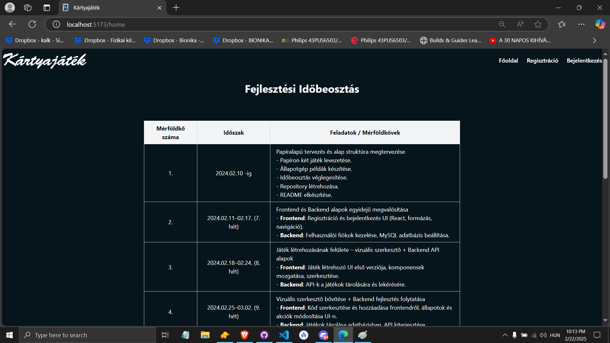
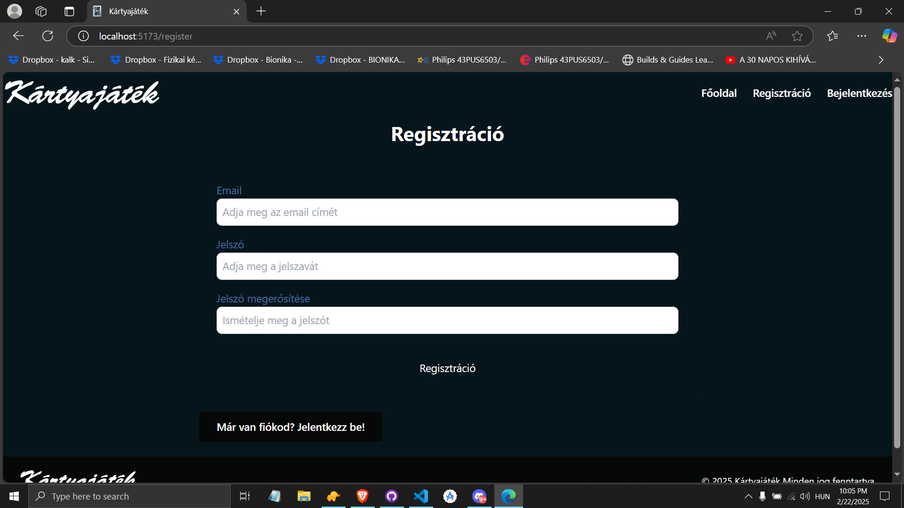
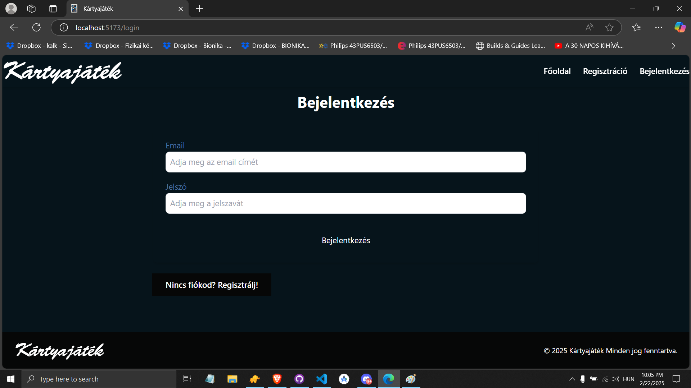
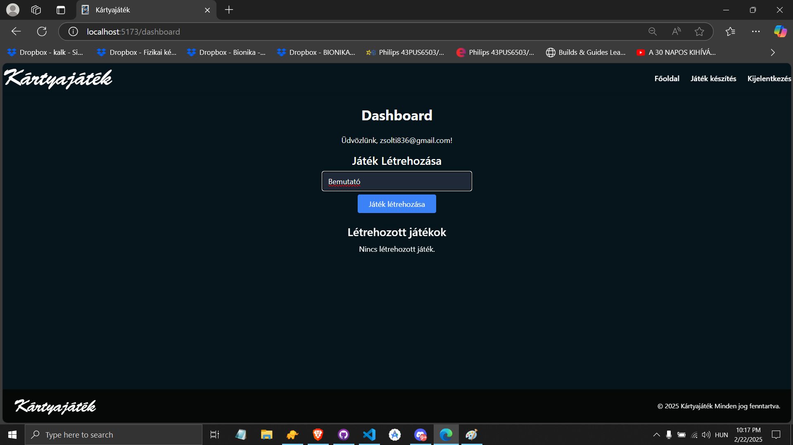
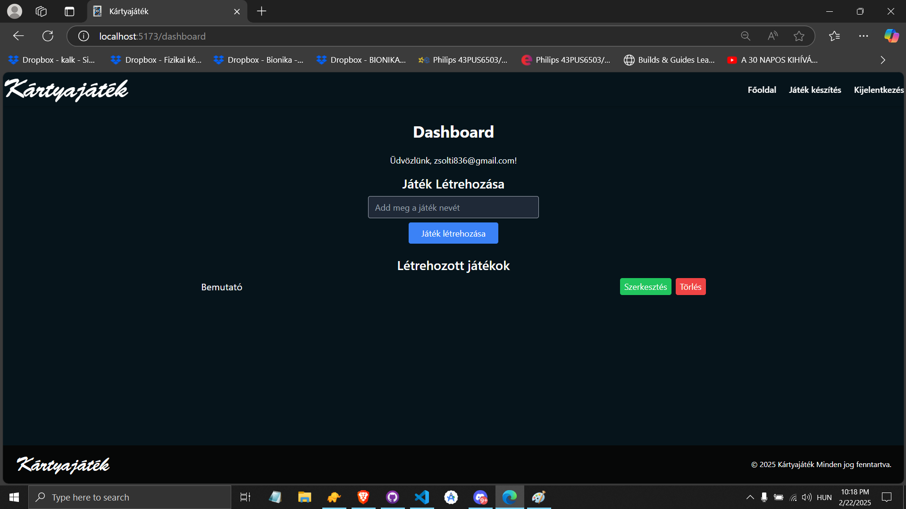
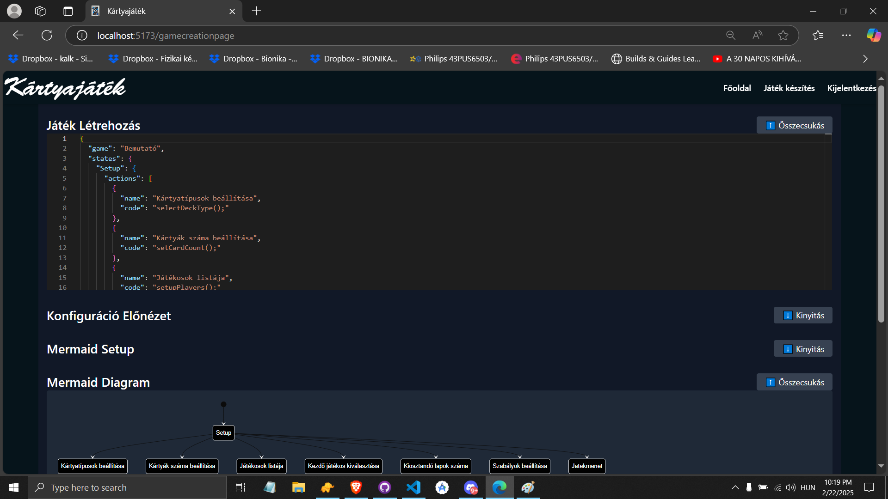
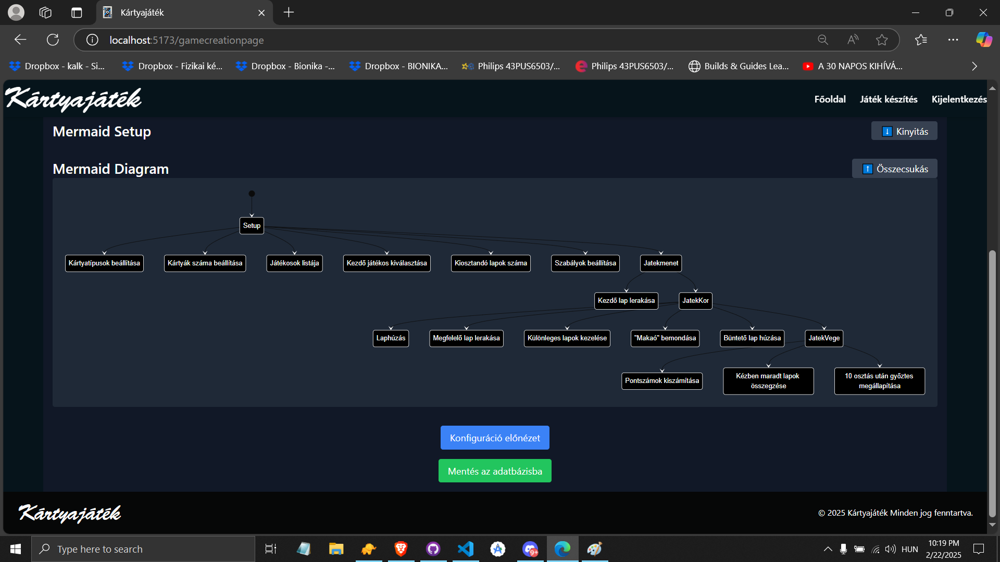
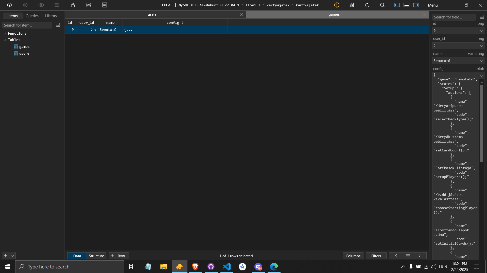

---

## Képek és Előnézetek

### Kezdőoldal

### Regisztráció

### Bejelentkezés

### Dashboard

### Game Creation Page

### Adatbázis Példa

---

## Backend Funkcionalitások

### Felhasználó Kezelés
- **Regisztráció (/register)**
  - Ellenőrzi, hogy email és jelszó meg vannak adva.
  - Ellenőrzi, hogy az adott email még nem létezik.
  - Jelszó hash-elése bcrypt segítségével.
  - Új felhasználó beszúrása a `users` táblába.

- **Bejelentkezés (/login)**
  - Ellenőrzi a megadott email és jelszó helyességét.
  - Ha sikeres, 1 órás érvényességű JWT tokent generál.

### Token Alapú Hitelesítés
- **authenticateToken Middleware**
  - Ellenőrzi a JWT token érvényességét minden védett végpontnál.
  - A tokenből kinyert adatok (id, email) hozzáférhetővé válnak a további kérések során.

### Játékok Kezelése
- **Játékok Listázása (/games GET)**
  - Visszaadja a bejelentkezett felhasználóhoz tartozó összes játékot.

- **Játék Létrehozása**
  - **POST /games:** Létrehoz egy új játékot csak a név alapján (két azonos nevű játék is megengedett).
  - **POST /games/config:** Létrehoz egy új játékot konfigurációval (JSON string formátumban), ha a játék még nem létezik.

- **Játék Konfiguráció Frissítése**
  - **PUT /games/:gameId/config:** Frissíti a meglévő játék konfigurációját az auto-increment id alapján.

- **Játék Törlése**
  - **DELETE /games/:gameId:** Törli a megadott id-jű játékot, ha az a bejelentkezett felhasználóhoz tartozik.

---

## Frontend Funkcionalitások

### Dashboard Oldal
- **Felhasználói Információ Megjelenítése:**
  - Lekéri és megjeleníti a bejelentkezett felhasználó email címét.
  
- **Játékok Listázása:**
  - Listázza a bejelentkezett felhasználóhoz tartozó játékokat.
  
- **Játék Létrehozása:**
  - Új játék név megadása és létrehozása a backend felé POST kéréssel.
  
- **Játék Szerkesztése:**
  - Minden játék mellett egy **Szerkesztés** gomb, amely navigál a `GameCreationPage` oldalra, átadva a játék mentett konfigurációját, nevét és egyedi azonosítóját.
  
- **Játék Törlése:**
  - Minden játék mellett egy **Törlés** gomb, amely törlés előtt egy promptot jelenít meg a felhasználónak. A törlés csak akkor hajtódik végre, ha a felhasználó a megadott megerősítő szöveget (pl. „TÖRÖLNI”) pontosan beírja.

### GameCreationPage Oldal
- **Konfiguráció Szerkesztése és Előnézete:**
  - A konfiguráció szerkesztése egy Monaco Editor segítségével történik.
  - A konfiguráció előnézetét és a hozzá generált Mermaid diagramot (vizuális állapotdiagram) összecsukható szekciókban jeleníti meg.

- **Konfiguráció Mentése:**
  - **Lokális Előnézet:** A „Konfiguráció előnézet” gomb validálja a JSON-t, és generálja a Mermaid diagram kódot.
  - **Adatbázisba Mentés:** A „Mentés az adatbázisba” gomb POST/PUT kérést küld a backendnek:
    - Ha a játék egyedi azonosítója (`gameId`) átadásra került, akkor PUT kéréssel frissíti a meglévő játék konfigurációját.
    - Ha nincs `gameId`, akkor új játék konfiguráció mentésére POST kérést küld.
  
- **Navigáció a Dashboardról:**
  - Ha a felhasználó szerkesztésre kattint a Dashboard-on, a GameCreationPage a navigáció state-ben kapja meg a játék mentett konfigurációját, nevét és id-jét.

